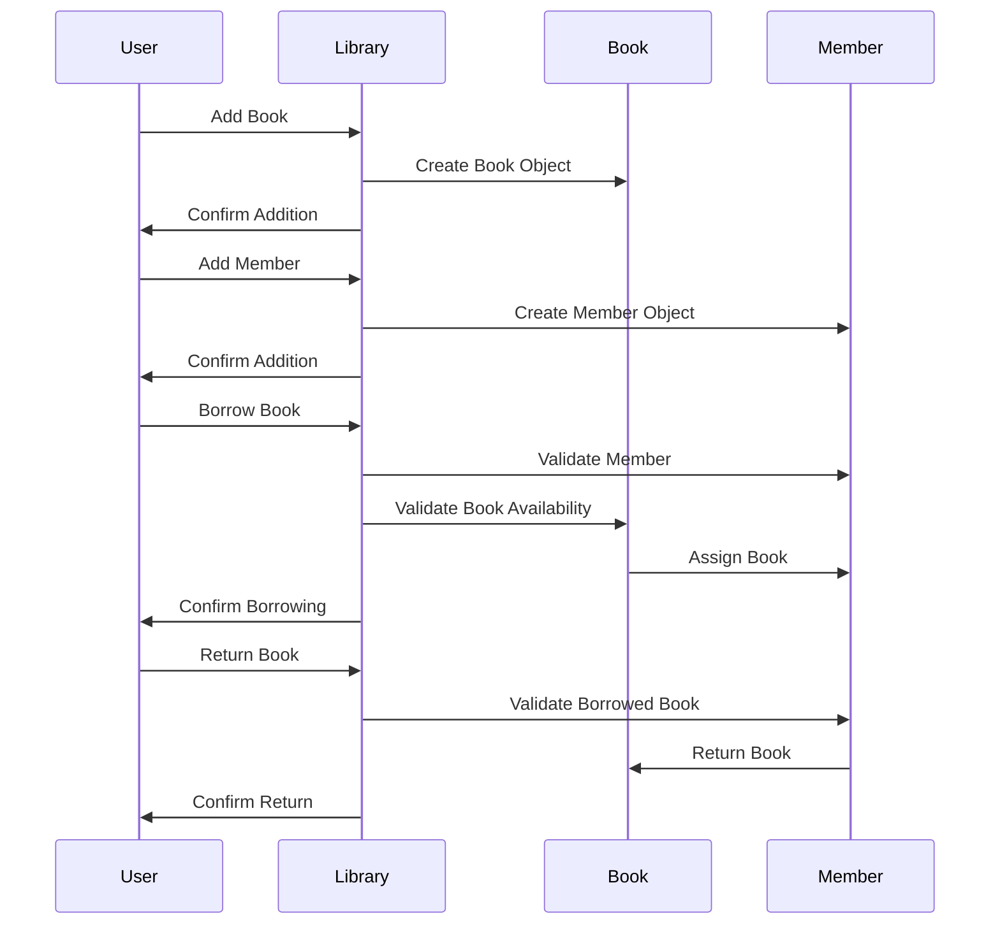
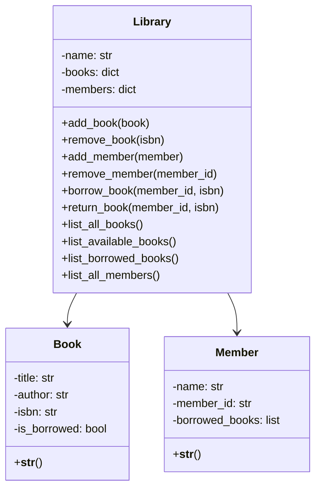
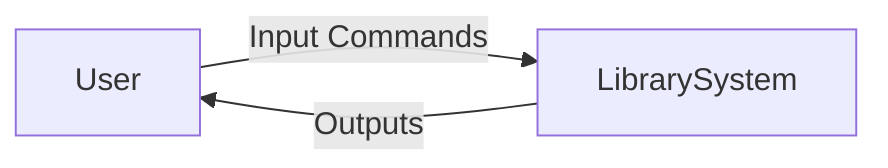
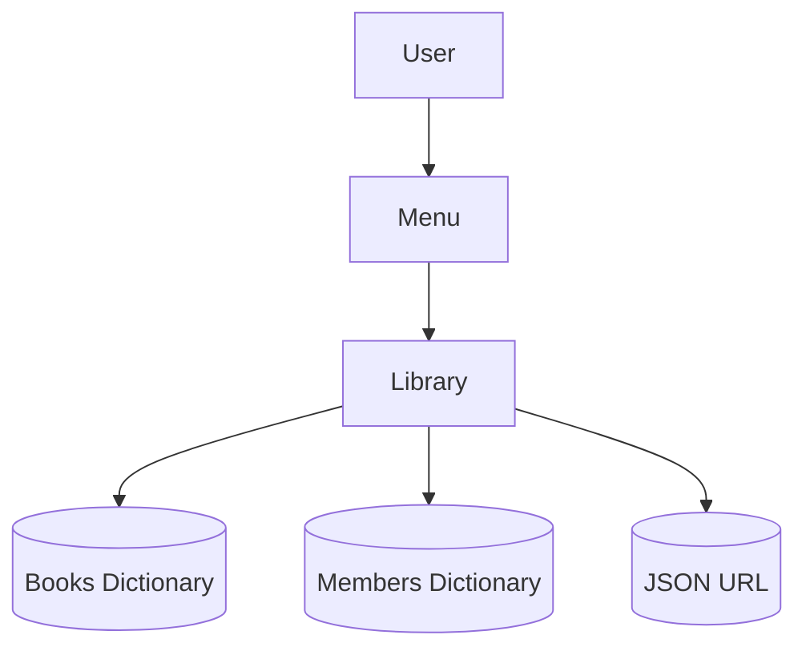

```markdown
# 🎨 Design Document: Library Management System

## 1. Introduction
The Library Management System is a Python-based application that manages books and members, supports borrowing/returning operations, and fetches book data from external JSON sources. This document outlines the **system design**, including functional and non-functional modules, and provides diagrams for better visualization.

---

## 2. System Architecture

### 📊 High-Level Architecture
```mermaid
flowchart TD
    A[User Interface: Console Menu] --> B[Library Class]
    B --> C[Book Class]
    B --> D[Member Class]
    B --> E[Book Data Loader (URL/JSON)]
    B --> F[Error Handling Module]
```

---

## 3. Functional Modules

| Module | Description |
|--------|-------------|
| **Book Management** | Add, remove, list, borrow, and return books. Tracks availability. |
| **Member Management** | Add, remove, and list members. Tracks borrowed books per member. |
| **Borrow/Return System** | Ensures valid borrowing and returning operations with error checks. |
| **Book Data Loader** | Fetches book data from a given URL (JSON format). Handles HTTP/JSON errors. |
| **Interactive Menu** | Console-based interface for user interaction. Provides options for all operations. |

### 📈 Functional Workflow


---

## 4. Non-Functional Modules

| Module | Description |
|--------|-------------|
| **Error Handling** | Robust handling of HTTP errors, JSON parsing errors, and invalid operations. |
| **Data Integrity** | Prevents duplicate ISBNs and member IDs. |
| **Scalability** | Designed to extend easily (e.g., database integration, GUI). |
| **Usability** | Simple console-based menu for ease of use. |
| **Maintainability** | Modular design with clear separation of concerns (Book, Member, Library). |

---

## 5. Class Diagram



---

## 6. Data Flow Diagram (DFD)

### Level 0 (Context Diagram)


### Level 1 (Detailed DFD)


---

## 7. Future Enhancements
- 🔄 Integration with a database (SQLite/MySQL).  
- 🌐 Web-based or GUI interface.  
- 📊 Analytics module (e.g., most borrowed books).  
- 🔒 Authentication for secure member management.  

---

## 8. Conclusion
This design ensures a **modular, maintainable, and scalable** Library Management System. The diagrams illustrate how different components interact, while functional and non-functional modules highlight the robustness of the system.

```

Would you like me to also generate a **visual banner diagram** (like a GitHub project overview graphic) to place at the top of your repo for extra polish?
